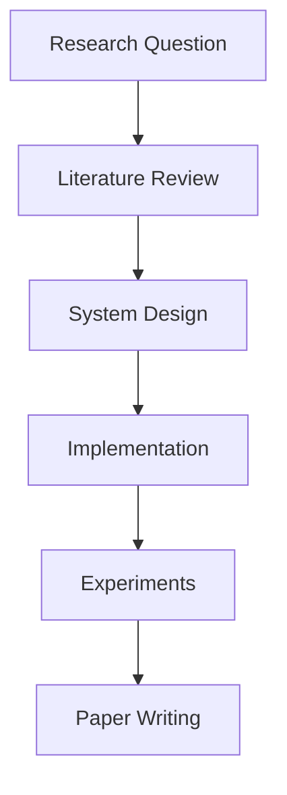

# Research Repository Template Generator

A comprehensive repository structure generator for academic research papers, designed to organize paper writing, experiments, architecture documentation, and supplementary materials.

## 🎯 Features

- 📝 Complete LaTeX paper structure with modular sections
- 🏗️ Architecture documentation organization
- 🧪 Experiment tracking and analysis folders
- 📊 Dedicated spaces for figures, tables, and diagrams
- 📚 Related work and survey notes organization
- 🔄 Evolution and iterative development tracking
- 📦 Dataset and appendix material management
- 📋 Progress tracking and reviewer notes

## 📦 Installation

No installation required! Uses Python standard library only.

**Requirements:**
- Python 3.x

## 🚀 Usage

Navigate to the directory where you want to create your research project and run:

```bash
python3 create_research_repo.py
```

The script creates the entire structure in the **current directory**.

### Example Workflow

```bash
# Create a new directory for your research project
mkdir MyResearchProject
cd MyResearchProject

# Run the generator
python3 /path/to/create_research_repo.py

# Structure is created in current directory
ls
```

## 📂 Generated Structure

```
ResearchProject/
├── README.md                          # Project overview
├── LICENSE                            # License file
│
├── paper/                             # LaTeX paper content
│   ├── main.tex                       # Main LaTeX document
│   ├── bibliography.bib               # References
│   ├── sections/                      # Paper sections
│   │   ├── abstract.tex
│   │   ├── introduction.tex
│   │   ├── related_work.tex
│   │   ├── system_architecture.tex
│   │   ├── implementation.tex
│   │   ├── evaluation.tex
│   │   ├── limitations.tex
│   │   └── conclusion.tex
│   ├── figures/                       # Paper figures/images
│   │   ├── router_orchestration.png
│   │   ├── persona_isolation.png
│   │   ├── validation_gate_flow.png
│   │   ├── pause_ask_resume.png
│   │   └── conversation_state_model.png
│   └── tables/                        # LaTeX tables
│       ├── hallucination_reduction.tex
│       ├── clarification_frequency.tex
│       ├── validation_failures.tex
│       └── deterministic_resume.tex
│
├── architecture/                      # System architecture docs
│   ├── system_overview.md
│   ├── router_orchestration.md
│   ├── persona_isolation.md
│   ├── sqlguardian_enforcement.md
│   ├── clarification_loop.md
│   ├── conversation_state.md
│   ├── observability.md
│   └── execution_planning.md
│
├── experiments/                       # Experimental work
│   ├── design/
│   │   ├── methodology.md
│   │   ├── experimental_setup.md
│   │   └── evaluation_protocol.md
│   ├── hallucination_analysis/
│   │   ├── cases.json
│   │   ├── before_after_comparison.md
│   │   └── guardian_blocking_examples.md
│   ├── ambiguity_clarification/
│   │   ├── ambiguous_queries.md
│   │   ├── clarification_traces.md
│   │   └── recovery_analysis.md
│   ├── validation_gate/
│   │   ├── blocked_queries.md
│   │   ├── retry_cycles.md
│   │   └── safety_invariants.md
│   └── multi_turn/
│       ├── deterministic_resume_cases.md
│       ├── state_transition_logs.md
│       └── conversation_trace_analysis.md
│
├── related_work/                      # Literature review
│   ├── survey_notes.md
│   ├── model_centric_approaches.md
│   ├── rag_pipelines.md
│   ├── self_reflection_systems.md
│   ├── enterprise_graph_systems.md
│   └── persona_architecture_analysis.md
│
├── evolution/                         # Design evolution tracking
│   ├── v1_linear_pipeline.md
│   ├── missing_components_analysis.md
│   ├── persona_inspiration.md
│   ├── router_vs_model_brain.md
│   └── architectural_enforcement_principle.md
│
├── diagrams/                          # Mermaid diagrams
│   ├── system_flow.mmd
│   ├── state_machine.mmd
│   ├── persona_transition_graph.mmd
│   ├── validation_retry_cycle.mmd
│   └── duplex_pause_resume.mmd
│
├── datasets/                          # Experimental datasets
│   ├── ambiguity_dataset.json
│   ├── hallucination_cases.json
│   └── validation_edge_cases.json
│
├── appendix_material/                 # Supplementary content
│   ├── persona_io_contracts.md
│   ├── formal_state_definition.md
│   └── extended_examples.md
│
└── notes/                             # Research notes
    ├── weekly_progress.md
    ├── open_questions.md
    ├── reviewer_questions.md
    └── future_work.md
```

## 📝 Structure Breakdown

### 📄 Paper (`paper/`)

Complete LaTeX paper structure following standard academic format:

- **Sections**: Modular `.tex` files for each paper section
- **Figures**: Placeholder images for your diagrams/visualizations
- **Tables**: LaTeX table files for experimental results
- **Main files**: `main.tex` and `bibliography.bib`

### 🏗️ Architecture (`architecture/`)

System design and architecture documentation:

- Component descriptions
- Design decisions
- System interactions
- Technical specifications

### 🧪 Experiments (`experiments/`)

Organized experimental work:

- **Design**: Methodology and protocols
- **Analysis folders**: Specific experiment types (hallucination, clarification, validation, multi-turn)
- **Results**: JSON data files and markdown analysis

### 📚 Related Work (`related_work/`)

Literature review and survey:

- Survey notes
- Categorized approaches
- Comparison analyses
- Inspiration sources

### 🔄 Evolution (`evolution/`)

Track design iterations:

- Version history
- Design decisions
- Architecture changes
- Lessons learned

### 📊 Diagrams (`diagrams/`)

Mermaid diagram files:

- System flows
- State machines
- Architectural diagrams
- Process flows

### 💾 Datasets (`datasets/`)

Experimental data in JSON format:

- Test cases
- Benchmark datasets
- Edge cases
- Validation data

### 📎 Appendix Material (`appendix_material/`)

Supplementary content:

- Formal definitions
- Extended examples
- Additional proofs
- Technical specifications

### 📓 Notes (`notes/`)

Research tracking:

- Weekly progress logs
- Open research questions
- Reviewer feedback
- Future work ideas

## 🔨 Building the Paper

### Compile LaTeX Document

```bash
cd paper
pdflatex main.tex
bibtex main
pdflatex main.tex
pdflatex main.tex
```

### Using latexmk (recommended)

```bash
cd paper
latexmk -pdf main.tex
```

## 📋 Recommended Workflow

### 1. Initial Setup

```bash
mkdir MyResearch
cd MyResearch
python3 create_research_repo.py
git init
git add .
git commit -m "Initial research structure"
```

### 2. Paper Writing

- Edit sections in `paper/sections/`
- Add figures to `paper/figures/`
- Create tables in `paper/tables/`
- Update `paper/bibliography.bib` with references

### 3. Architecture Documentation

- Document system design in `architecture/`
- Create diagrams in `diagrams/` (Mermaid syntax)
- Link architecture docs from paper

### 4. Experiments

- Define methodology in `experiments/design/`
- Run experiments and save results
- Document analysis in respective folders
- Update paper sections with findings

### 5. Literature Review

- Take notes in `related_work/`
- Categorize by approach/method
- Reference in `paper/sections/related_work.tex`

### 6. Progress Tracking

- Update `notes/weekly_progress.md`
- Maintain `notes/open_questions.md`
- Track reviewer feedback in `notes/reviewer_questions.md`

## 🎨 Customization

### Adding New Sections

Edit the `structure` dictionary in `create_research_repo.py`:

```python
structure = {
    "paper": {
        "sections": [
            "abstract.tex",
            "introduction.tex",
            # Add your custom section
            "your_section.tex",
        ],
        # ...
    },
    # Add new top-level folders
    "your_folder": ["file1.md", "file2.md"],
}
```

### Removing Unused Sections

Comment out or remove sections you don't need from the `structure` dictionary.

## 📊 Diagram Creation

Create diagrams using Mermaid syntax in `.mmd` files:



Convert to images using:
- [Mermaid Live Editor](https://mermaid.live/)
- [mermaid-cli](https://github.com/mermaid-js/mermaid-cli)
- VS Code Mermaid extensions

## 📚 LaTeX Setup

### Required Packages

Ensure your LaTeX distribution includes:
- Standard article class
- BibTeX for bibliography
- graphicx for figures
- booktabs for tables
- hyperref for links

### Recommended LaTeX Template

```latex
\documentclass{article}
\usepackage{graphicx}
\usepackage{booktabs}
\usepackage{hyperref}

\title{Your Research Title}
\author{Your Name}

\begin{document}
\maketitle

\input{sections/abstract}
\input{sections/introduction}
% ... other sections

\bibliographystyle{plain}
\bibliography{bibliography}

\end{document}
```

## 🔄 Version Control

### Git Best Practices

```bash
# Initialize repository
git init

# Create .gitignore
echo "*.aux
*.log
*.out
*.pdf
*.synctex.gz
__pycache__/
*.pyc" > .gitignore

# Commit structure
git add .
git commit -m "Initial research repository structure"

# Create branches for different aspects
git checkout -b paper-writing
git checkout -b experiments
git checkout -b architecture-docs
```

## 📖 Use Cases

This template is ideal for:

- ✅ Academic research papers
- ✅ Conference paper submissions
- ✅ Thesis/dissertation writing
- ✅ Technical reports
- ✅ System architecture documentation
- ✅ Experimental research projects
- ✅ Literature surveys
- ✅ Research proposals

## 🐛 Troubleshooting

### Files not created

- Ensure you have write permissions in the current directory
- Check Python version (`python3 --version`)

### LaTeX compilation errors

- Install complete LaTeX distribution
- Check for missing packages
- Verify file paths in `\input{}` commands

## 💡 Tips

1. **Start with README**: Fill out project overview first
2. **Track daily**: Update `notes/weekly_progress.md` regularly  
3. **Version diagrams**: Keep diagram sources in `diagrams/`
4. **Document experiments**: Record methodology before running experiments
5. **Regular commits**: Commit progress frequently with meaningful messages
6. **Backup data**: Keep datasets and results backed up

## 👥 Author

Cognic AI Development Team

## 🔗 Related Tools

- [SRS Template Generator](../Software%20Requirement%20Specifications/README.md)
- [FastAPI Backend Generator](../Backend/FastAPI/README.md)

## 📞 Support

For issues or questions, please open an issue in the [main repository](../).

---

**Happy Researching! 📚🔬**
